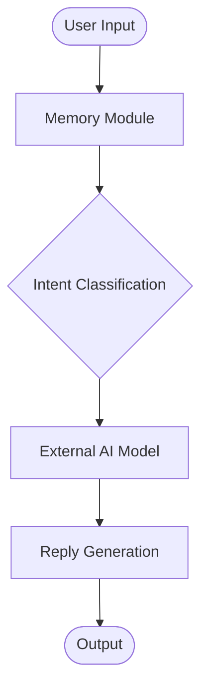

# Intelligent Health-Record Assistant

An AI-powered agent designed to demystify medical data, helping patients understand their health records, lab reports, and prescriptions through simple, empathetic, and context-aware conversations.

## 🏥 Problem Statement
Modern healthcare generates vast amounts of data that can be overwhelming for patients. Complex jargon and unexplained numbers in lab reports often lead to anxiety and confusion. The **Intelligent Health-Record Assistant** bridges this gap by acting as a compassionate translator for your medical data.

## ✨ Key Features
*   **Multimodal Analysis**: Upload photos of lab reports or prescriptions. The assistant uses **Google Gemini** to "see" and interpret the data directly.
*   **Contextual Memory**: Remembers your conversation history, allowing for follow-up questions without needing to re-explain your situation.
*   **Intent Classification**: Smartly detects if you need a summary, a specific term explanation, or general health advice.
*   **Empathetic Responses**: Delivers medically grounded information in a supportive and easy-to-understand tone.

## 🏗️ Architecture
The system follows a structured agentic flow:
1.  **User Input**: Text or Image (Medical Record).
2.  **Memory Module**: Retrieves relevant context from past interactions.
3.  **Intent Classifier**: Routes the request (e.g., "Explain this value" vs. "Summarize report").
4.  **External AI (Gemini)**: Generates the core insight.
5.  **Reply Generation**: Formats the response for the user.



## 🚀 Getting Started

### Prerequisites
*   Python 3.8+
*   Jupyter Notebook
*   Google Gemini API Key

### Installation
1.  **Clone the repository** (or download the project files).
2.  **Install dependencies**:
    ```bash
    pip install google-generativeai jupyter
    ```
3.  **Set up your API Key**:
    Ensure you have your `GOOGLE_API_KEY` ready. You may need to set it as an environment variable or input it when running the notebook.

### Usage
1.  Open the notebook:
    ```bash
    jupyter notebook intelligent-health-record-assistant.ipynb
    ```
2.  Run the cells to initialize the assistant.
3.  Interact with the chat interface to ask questions or upload images of your health records.

## 🛠️ Technologies Used
*   **Python**: Core programming language.
*   **Google Gemini**: Multimodal LLM for vision and text processing.
*   **Jupyter**: Interactive development environment.

## ⚠️ Disclaimer
This tool is for informational purposes only and does not provide medical diagnosis or treatment. Always consult with a qualified healthcare professional for medical advice.
